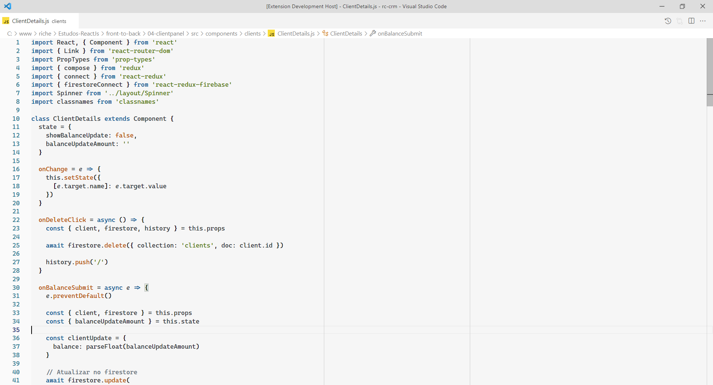

# README
## This is my light theme, based on current theme (2022) from stackoverflow.

Better experience using a cascadia code font.

## Installation

Search for `Stack manibu overflow'

## Variants

-   Stack Manibu Overflow

### Screenshots

## Contributing

Please, report issues/bugs and suggestions for improvements to the issue [here](https://github.com/jdinhify/stack-manibu-overflow/issues).

Thanks for help to make the Gruvbox theme better.

Copyright (C) 2022 [RichellyItalo](https://github.com/richellyitalo)
